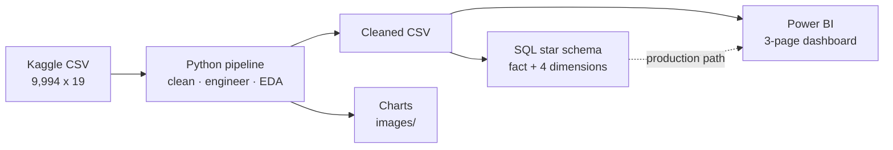

<div align="center">

# SaaS Sales Performance Analytics

**Finding where a B2B SaaS company's margin leaks — and what to do about it.**

[](https://www.python.org/)
[](https://pandas.pydata.org/)
[](https://www.postgresql.org/)
[](https://powerbi.microsoft.com/)
[](tests/)
[](LICENSE)

</div>

---

## Overview

An end-to-end analytics project on 9,994 B2B SaaS transactions, built across three layers:
a **Python pipeline** for cleaning and analysis, a **PostgreSQL star schema** for
dimensional modelling, and a **Power BI dashboard** for presentation.

The headline result: **margin holds at ~20% on undiscounted deals and turns negative past a
~20% discount.** There is a cliff, and past it the company pays for the privilege of closing
the deal. That turned a reporting request into a discount-policy recommendation.

> **On the numbers in this repo.** The repository runs out of the box using a synthetic
> sample generator, so every figure quoted in the reports is from that sample and is marked
> 🔸. Download the real dataset (below), re-run the pipeline, and update those figures before
> presenting. The shape of each finding holds; the exact values will differ.

## Business problem

A B2B SaaS company selling sales and marketing software across AMER, EMEA, and APJ is
profitable overall but cannot see where that profit comes from or where margin leaks.
Regional staffing, discount approvals, and segment prioritisation are decided on judgement
rather than evidence.

## Objectives

1. Identify the most profitable regions, industries, segments, and products.
2. Quantify how discounting affects margin.
3. Surface loss-making products.
4. Measure revenue concentration risk.
5. Track performance over time.

## Architecture



Cleaning and feature engineering happen **once**, in Python. SQL owns the dimensional model.
Power BI presents. One source of truth for every derived field.

Full detail, including the ER diagram: [`docs/architecture.md`](docs/architecture.md).

## Folder structure

```
saas-sales-analytics/
├── data/
│   ├── raw/                  # put the downloaded CSV here (gitignored)
│   ├── processed/            # pipeline output (gitignored)
│   ├── sample/               # synthetic sample (gitignored)
│   └── dataset_source.md     # provenance, licence, alternatives
├── notebooks/
│   └── 01_exploratory_analysis.ipynb
├── sql/
│   ├── 01_schema_and_etl.sql       # star schema + ETL + validation
│   └── 02_analysis_queries.sql     # 15 queries, 2 views, stored procedure
├── src/
│   ├── config.py                   # all paths and constants
│   ├── utils.py                    # logging + safe file IO
│   ├── pipeline.py                 # the six pipeline stages
│   └── generate_sample_data.py     # synthetic data generator
├── dashboards/
│   ├── SaaS_Sales_PowerBI_Dashboard_Guide.pdf   # 34-page build guide
│   ├── Power_BI_Build_Guide.md
│   ├── powerquery_load.m
│   ├── dax_measures_and_columns.txt
│   └── powerbi_theme.json
├── reports/
│   ├── business_report.md
│   ├── executive_summary.md
│   ├── presentation_outline.md
│   └── portfolio_assets.md
├── docs/
│   ├── data_dictionary.md
│   ├── architecture.md
│   ├── methodology.md
│   └── assumptions_and_limitations.md
├── images/                   # generated charts
├── tests/                    # pytest suite
├── requirements.txt
├── environment.yml
├── .gitignore
├── LICENSE
├── README.md
├── CHANGELOG.md
└── CONTRIBUTING.md
```

## Dataset

| | |
|---|---|
| **Name** | Amazon AWS SaaS Sales |
| **Official website** | https://www.kaggle.com/datasets/nnthanh101/aws-saas-sales |
| **Rows / columns** | 9,994 × 19 |
| **Grain** | One row per **order line** (one order spans multiple rows) |
| **Target** | None — descriptive and diagnostic analytics |

The dataset is **fictitious** and Kaggle is its only distribution point. That places it last
in a source-priority order that prefers government portals, UCI, and other official sources.
[`data/dataset_source.md`](data/dataset_source.md) documents this openly, including the
official-source alternative (UCI *Online Retail*) and why this project keeps the SaaS
dataset despite the trade-off.

Full column definitions: [`docs/data_dictionary.md`](docs/data_dictionary.md).

## Installation

```bash
git clone https://github.com/AJ1206/saas-sales-analytics.git
cd saas-sales-analytics

python -m venv .venv
source .venv/bin/activate          # Windows: .venv\Scripts\activate
pip install -r requirements.txt
```

Conda alternative: `conda env create -f environment.yml`

## Usage

**Option A — run immediately with synthetic data (no account needed):**

```bash
python src/generate_sample_data.py   # writes data/sample/
python src/pipeline.py               # runs the full pipeline
```

**Option B — the real dataset (use this for anything you present):**

1. Download from https://www.kaggle.com/datasets/nnthanh101/aws-saas-sales
2. Save it as `data/raw/aws_saas_sales.csv`
3. `python src/pipeline.py` — the real file is detected automatically.

The pipeline logs to console and `logs/`, writes charts to `images/`, and exports a cleaned
CSV to `data/processed/`.

**SQL layer** (PostgreSQL, after running the pipeline):

```bash
psql -d your_db -f sql/01_schema_and_etl.sql     # builds + loads the star schema
psql -d your_db -f sql/02_analysis_queries.sql   # runs the query library
```

**Power BI layer:** follow
[`dashboards/SaaS_Sales_PowerBI_Dashboard_Guide.pdf`](dashboards/) — a 34-page from-scratch
guide. Paste `powerquery_load.m` to load the data, add the measures from
`dax_measures_and_columns.txt`, and import `powerbi_theme.json`.

**Tests:**

```bash
pytest tests/ -v
```

## Key insights 🔸

| # | Finding | Recommendation |
|---|---|---|
| 1 | **Margin cliff at ~20% discount.** 20.0% margin at no discount → 4.2% at 11–20% → **−6.3% at 21–30%** → **−17.1% past 30%**. Correlation −0.70. | Discount-approval threshold with finance sign-off above the cliff |
| 2 | **Marketing Suite runs at −17.9% margin**, destroying $816K — offsetting 60%+ of the best product's contribution | Reprice, bundle, or retire it |
| 3 | **Top 10 customers = 53% of revenue** | Treat as a risk register item; set a concentration target |
| 4 | **Regions and segments perform evenly** (margins within 0.5pp) | The problem is product and discounting, not geography |

Full analysis: [`reports/business_report.md`](reports/business_report.md).

## Screenshots

| Profit by product | Discount vs margin |
|---|---|
|  |  |

| Sales & profit by region | Monthly trend |
|---|---|
|  |  |

### Dashboard preview

> *Placeholder — build the dashboard using the guide in `dashboards/`, then capture and add:*
>
> - `images/dashboard_page1_overview.png` — Executive Overview (KPI cards, trend, region, profit by product, top customers)
> - `images/dashboard_page2_discount.png` — Product & Discount deep-dive
> - `images/dashboard_page3_customers.png` — Customer Analysis with Pareto concentration
>
> A `.pbix` is not committed — see [Why no .pbix](#why-no-pbix-file) below.

## Why no .pbix file

A `.pbix` contains a **compiled VertiPaq data model** that only Power BI Desktop's engine can
produce. It cannot be authored as text, and a hand-fabricated file would fail to open. Rather
than ship something broken, this repo provides every asset needed to rebuild the report in
about an hour: the Power Query M script, all 16 DAX measures, the theme JSON, and a 34-page
step-by-step guide. The dashboard you build this way is also one you can defend in an
interview, which a handed-over file is not.

## Future improvements

- Connect Power BI directly to the PostgreSQL star schema rather than the flat CSV.
- Add cost data to decompose margin into its drivers.
- Add forecasting once a longer time series is available.
- Row-Level Security so regional managers see only their own region.
- CI (GitHub Actions) to run `pytest` on every push.

## Technologies used

| Layer | Stack |
|---|---|
| **Language** | Python 3.11 |
| **Analysis** | pandas, NumPy |
| **Visualisation** | Matplotlib (static), Plotly (interactive) |
| **Database** | PostgreSQL (star schema, CTEs, window functions, views, stored procedure) |
| **BI** | Power BI Desktop (Power Query M, DAX, drill-through, bookmarks, custom theme) |
| **Testing** | pytest |
| **Tooling** | logging, virtualenv / conda |

## Credits

- **Dataset:** published on Kaggle by [nnthanh101](https://www.kaggle.com/datasets/nnthanh101/aws-saas-sales).
- **Author:** Akshay Juluru — [GitHub](https://github.com/AJ1206) · [LinkedIn](https://www.linkedin.com/in/akshay-juluru-574164260)

## References

1. Amazon AWS SaaS Sales dataset — https://www.kaggle.com/datasets/nnthanh101/aws-saas-sales
2. Kimball, R. & Ross, M. *The Data Warehouse Toolkit* — dimensional modelling and degenerate dimensions.
3. Microsoft Power BI DAX reference — https://learn.microsoft.com/en-us/dax/
4. Microsoft Power Query M reference — https://learn.microsoft.com/en-us/powerquery-m/
5. UCI *Online Retail* (official-source alternative) — https://archive.ics.uci.edu/dataset/352/online+retail

## License

MIT — see [LICENSE](LICENSE). The dataset carries its own terms; check the source page before
redistributing.
