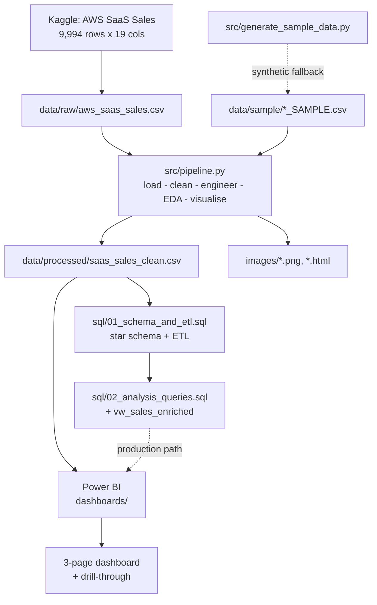
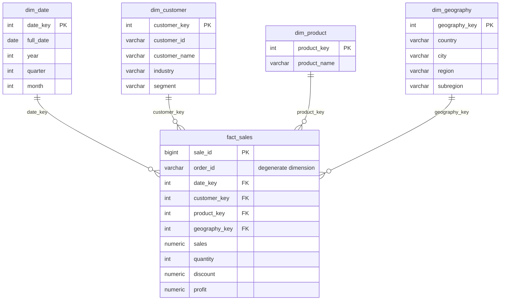
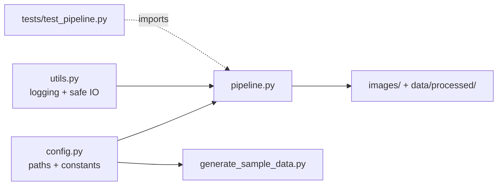

# Architecture

## Pipeline overview

Three layers with a clear separation of concerns: Python cleans and analyses, SQL models
and serves, Power BI presents. Each layer hands a well-defined artefact to the next.

## Why this shape

- **Cleaning happens once, in Python.** Feature engineering is not duplicated in SQL or DAX,
  so there is a single source of truth for every derived field.
- **SQL owns the dimensional model.** The star schema is the serving layer; Power BI can
  connect to it directly in a production setup.
- **Power BI owns presentation only.** It consumes either the flat cleaned CSV (simple) or
  the star schema (production).

## Data model (star schema)

`order_id` is kept in the fact table as a **degenerate dimension** — an identifier with no
dimension table of its own. It is what makes `COUNT(DISTINCT order_id)` possible even
though a single order occupies several fact rows.

## Module structure

| Module | Responsibility |
|---|---|
| `config.py` | Every path and constant. Derived from `PROJECT_ROOT`, so the pipeline runs from any working directory. |
| `utils.py` | Logger setup (console + file) and CSV read/write with actionable errors. |
| `pipeline.py` | The six pipeline stages, one function per concern. |
| `generate_sample_data.py` | Schema-matched synthetic data so the repo runs without the Kaggle download. |
